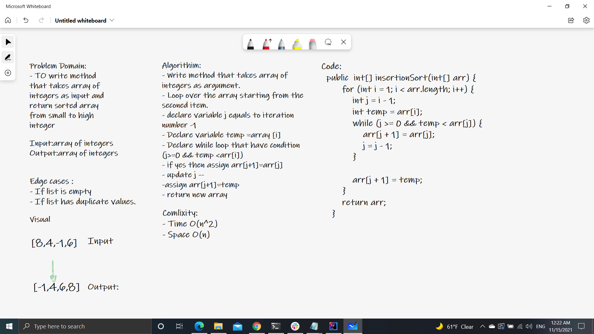

# data-structures-and-algorithms:InsertionSort

- This method takes array of integers as input and return sorted array from small to high integer.

### Approach & Efficiency:
 
 * Time Complixity O(n^2)
 * Space Complixity O(n)
