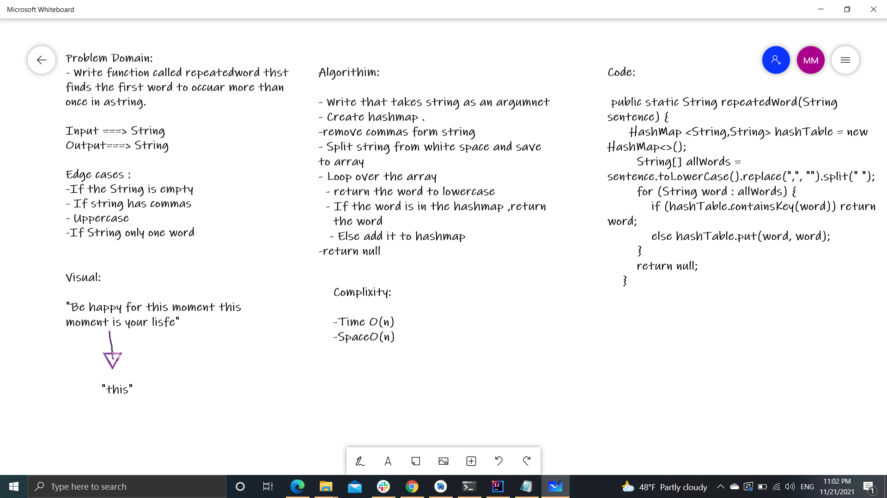

# Challenge Summary :hashmap-repeated

* This function called repeatedword that finds the first word to occur more than once in a string and return it.

## Whiteboard Process

## Approach & Efficiency
- Time O(n)
- Space O(n)

