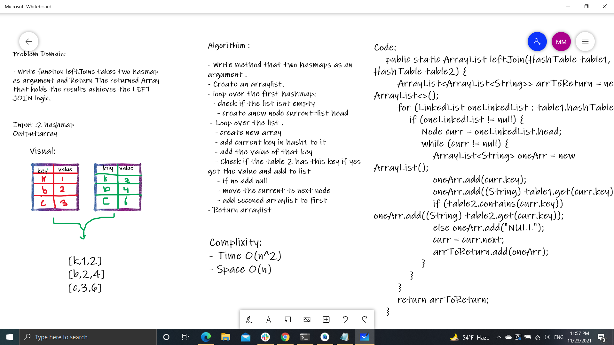

# Hashmap LEFT JOIN

- he LEFT JOIN keyword returns all records from the left table (table1), and the matching records from the right table (table2). The result is 0 records from the right side, if there is no match.

## Challenge

- This function leftJoins takes two hasmap as argument and Return The returned Array that holds the results achieves the LEFT JOIN logic.

## Approach & Efficiency

Complixity:
- Time O(n^2)
- Space O(n)

## Solution

