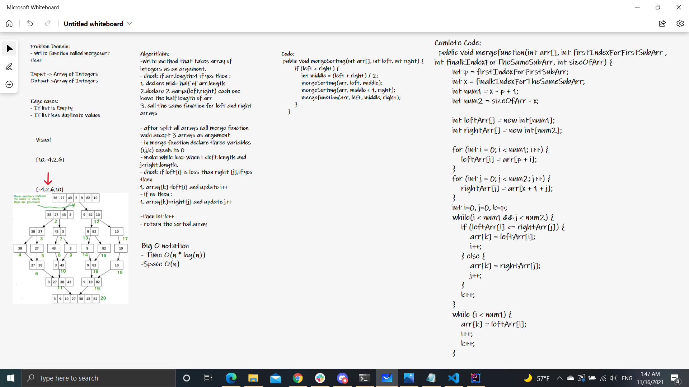
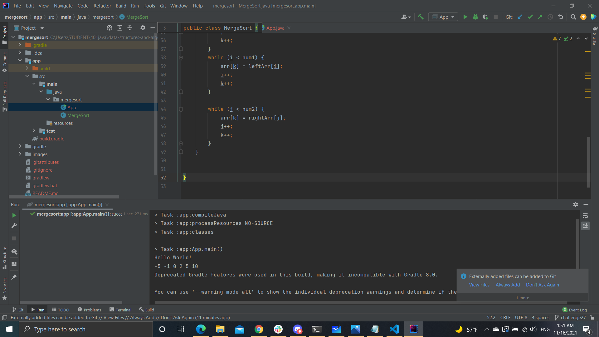

# mergesort:
Sorting an array by dividing it to two half each time until it is sorted from the smallest to the largest number and then merge it.

# White Bord

# Approach & Efficiency:

- Time: n*log(n):

- Space: O(n)

# Solution:
