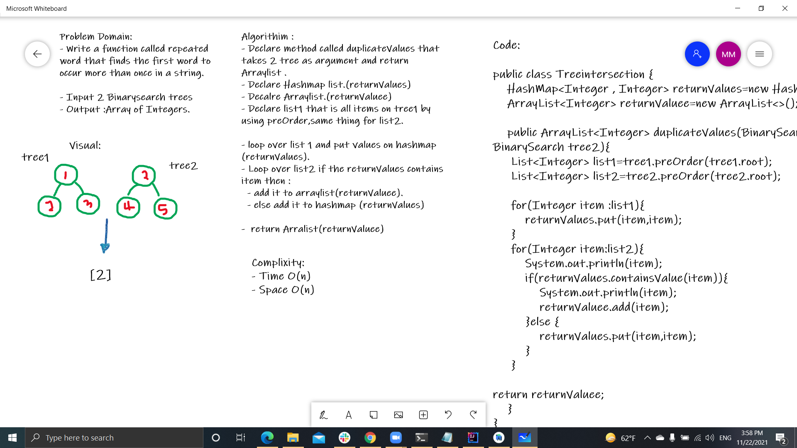

# Challenge Summary

- This method a function called tree_intersection that takes two binary trees as parameters.
  Using your Hashmap implementation as a part of your algorithm, return a set of values found in both trees.

## Whiteboard Process

## Approach & Efficiency

- complixity 
  
  - Time O(n)
  - Space O(n)

## Solution

- Clone the repo from GitHub and open the project folder inside your IDE then open file.then build it ,you can run the library by ./gradlew run,and run the test by ./gradlew test.
